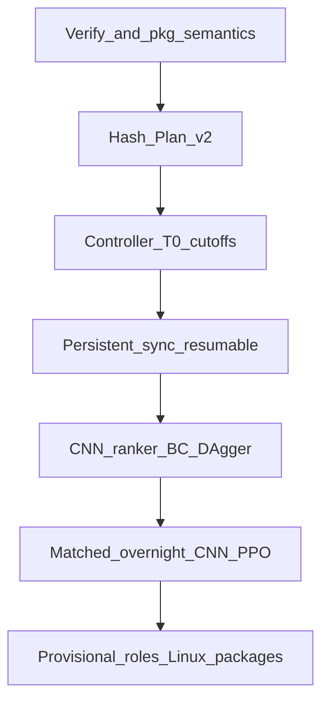

# Phase 9F generated execution plan v2 (LOCKED)

**Plan hash source:** experiments/manifests/phase9f_generated_plan_v2.json
**Supersedes:** plans/phase9f-generated-execution-plan.md (v1 hash preserved)
**Deadline:** 2026-08-05T08:00:00+01:00
**Canonical portal:** heuristic_v2f_plus_planner_terminal_fix / QS-P9F-PORTAL-V0
**Primary learned:** QS-P9F-CNN-RANKER-V1
**Mandatory:** synchronous recurrent CNN-PPO overnight

# Phase 9F continuation — CNN recurrent ranker + mandatory overnight RL

## Locked starting point (do not redo)

- Branch: `research/phase9f-autonomous-rebuild-v1` @ **`ab7c9c0`**
- Tag: `phase9f-autonomous-rebuild-v1-start-3ee4815`
- Phase 9E terminal: `3ee4815` — four arms `NO_MEANINGFUL_IMPROVEMENT`
- Architecture: **heuristic legal candidates + CNN recurrent ranker + PPO**
- Done: within-call GAE `V(s_T)` + done masks; portal ZIPs under `dist/upload_ready/` (**mislabelled**)
- Open critical: fresh `GeneralsEnv` every chunk; no `actors.py`; belief not on learned path

### Canonical portal ID

```text
Canonical: heuristic_v2f_plus_planner_terminal_fix
Stable ID: QS-P9F-PORTAL-V0
Typos (not distinct): terminal_force, terminal_form
```

Deadline: **2026-08-05T08:00:00+01:00**. No Phase 9E rerun. No broad re-audit. No second controller.

## Corrected stage order

```text
verify → package semantics → Plan v2 hash → recovery tag
→ controller per Plan v2 → persistent actors → belief/modes
→ CNN-ranker BC → DAgger/hybrid → matched CNN-PPO → overnight
→ tournament → Linux/CPU → strict packages
```

Before Plan v2 is hashed: no substantive trainer/controller implementation.

## Hard overnight timebox (T0-relative + absolute floors)

Controller records **T0** when Plan v2 execution begins.

| Bound | Target |
| --- | --- |
| ASAP | Plan v2 + package correction |
| **T0 + 90 min** | persistent actors + continuity gates PASS |
| **T0 + 150 min** | min belief + teacher data + CNN-BC path |
| **T0 + 165 min** | matched PPO pilot start |
| Absolute **04:00** | strongest valid trainable source on mandatory PPO path (no later) |
| Absolute **07:15** | stop collection; qualify finalists |
| Absolute **08:00** | clean exit |

### Degradation checkpoints (absolute local)

| Local | Action if behind |
| --- | --- |
| **02:15** | actors not PASS → stop aliases/dashboard/graph/non-critical specialists; focus actors+recurrence+belief |
| **02:45** | freeze min teachers (portal+explore+attack+convert/DT); portal fallback economy/defence; start min dataset |
| **03:00** | freeze architecture breadth |
| **03:15** | CNN-BC incomplete → one repair → strongest CNN ckpt → smoke → ≤1 DAgger → preserve PPO |
| **03:45** | hybrid incomplete → PPO from source ladder; no polish |
| **07:15** | stop; atomic ckpt; eval; deploy qual; registries |

Protected priority: persistent actors → belief → sync freshness → min teacher data → CNN-BC → PPO pilot → overnight PPO.

Never bypass: actor continuity, termination/truncation, belief lifecycle, policy freshness, legal actions. RL gates: `PASS` / `FAIL_WITH_ATTEMPTED_EVIDENCE` / `BLOCKED_EXTERNAL` only.

## Research traceability

Create with Plan v2:

- [`docs/research/phase9f_research_traceability.md`](docs/research/phase9f_research_traceability.md)
- [`experiments/manifests/phase9f_research_traceability.json`](experiments/manifests/phase9f_research_traceability.json)

| Family | Implementation | Exclusion / deviation |
| --- | --- | --- |
| AlphaStar/SCC | Teacher→BC→DAgger→PPO; legal candidates; league; recurrent | No TPU/transformer/full league |
| R2D2 | Persistent hidden; burn-in; truncated BPTT | On-policy PPO not DQN |
| IMPALA | Persistent CPU actors; CUDA batches | Sync PPO only; no V-trace |
| Option-Critic | Mode initiation/termination/hysteresis | Explicit rules, not learned options |
| DAgger | ≤1 aggregation round | Overnight-bounded |
| Reverse curriculum | Near-win→full-game ladder | No unstructured mixture |
| Potential shaping | `F_t=c(γΦ(s')−Φ(s))`; `Φ(terminal)=0` | ≤1 family between arms |
| Invalid-action masking | Pre-sample executable mask + hash replay | — |
| AlphaGo search | 1–2 ply tactical only | No whole-game MCTS |
| OpenAI Five PPO | Matched+overnight after CNN warm start | Laptop budget |
| Exploration | Strategic info gain | No RND novelty |
| Imperfect-info | Compact visible belief | No ReBeL/DeepNash |

## Stage 1 — Package semantics

```text
submission/packages/                  canonical immutable builds
dist/windows_smoke_passed/            Windows protocol smoke only
dist/research_candidates/             intermediate research models
dist/legacy_mislabelled_upload_ready/ historical mislabelled aliases + MIGRATION.md
dist/upload_ready/                    strict OFFICIAL_UPLOAD_READY only (starts empty)
dist/roles/                           best_overall and role refs with alias_of
```

Canonicalize portal to `heuristic_v2f_plus_planner_terminal_fix` / `QS-P9F-PORTAL-V0`. Semantics report + registries v2.

### Package-correction time limit (≤15 minutes)

Before Plan v2 lock: preserve ZIP paths/hashes; write corrected qualification metadata; canonicalize IDs; set `official_upload_ready=false`; create migration plan + registries. Cap this stage at **15 minutes**. If physical move/copy would exceed that: leave files in place; mark `LEGACY_MISLABELLED` in registry; defer physical migration to final packaging. Package housekeeping must not delay persistent actors, recurrence, belief, CNN-BC, or mandatory PPO.

## Stage 2 — Plan v2 lock then controller

Hash Plan v2 including research, CNN-primary, sync-PPO, shield-as-policy, T0 cutoffs, ckpt/normaliser/mismatch clauses. Then amend [`scripts/run_phase9f_autonomous.py`](scripts/run_phase9f_autonomous.py).

## Stage 3 — Persistent actors + sync PPO + resumable checkpoints

New: [`actors.py`](src/generals_bot/training/actors.py), [`rollout.py`](src/generals_bot/training/rollout.py), [`recurrent_buffer.py`](src/generals_bot/training/recurrent_buffer.py); update [`ppo.py`](src/generals_bot/training/ppo.py).

Preserve across fragments: env, episode, map, seat, **opponent identity/memory/recurrent/RNG**, belief, learner recurrent, all RNGs, turn/growth/DT, curriculum, executed actions.

Bootstrap: `V(next_obs, next_h, next_belief)`; `continuation_mask = 1 - terminated`.

Sync freshness: freeze N → collect → pause → verify → update on N only → publish N+1. Full provenance hashes per fragment. No async/V-trace tonight.

### Canonical training checkpoint (fully resumable)

Must include: model params; optimiser; LR scheduler; AMP GradScaler (if AMP); policy version; PPO update number; transition count; completed-game count; recurrent actor snapshots; env reconstruction; obs-norm stats; reward/return-norm stats; candidate-generator config+hash; belief/obs schema versions; RNG states; curriculum state; opponent-league sampling state.

Resume verifies all hashes before further collection. **Weights-only = evaluation checkpoint, not resumable training.**

### Checkpoint resume fallback (do not block PPO)

Live persistent-actor continuity is mandatory. Exact mid-episode checkpoint/resume is preferred but must not consume the PPO window.

Attempt in order: (1) direct env-state serialise + verified restore; (2) deterministic seed + full action replay + state-hash verify; (3) canonical checkpoint only at completed episode boundaries.

When (1)/(2) cannot be proven within repair budget: keep live cross-fragment continuity while the process is alive; retain atomic model/optimiser checkpoints; checkpoint at episode boundaries; mark mid-episode resume `PARTIAL_WITH_EPISODE_BOUNDARY_FALLBACK`; record max lost work; do not claim exact mid-episode resume. Do **not** delay the mandatory PPO pilot for perfect arbitrary-turn env serialisation.

Gates: `PERSISTENT_ACTOR_GATE`, `CHUNK_CREDIT_CONTINUITY_GATE`, `EPISODE_RESUME_GATE`, `POLICY_FRESHNESS_GATE`. Max 2 repairs. Block strategic PPO until PASS.

## Stage 4 — Recurrent sequences + valid-timestep losses

Episode-consistent windows; burn-in; truncated BPTT; seq 64/128; burn-in 16/32; bounded gamma probes.

### Loss masking

- PPO policy loss: valid, loss-bearing, **non-intervention** timesteps only
- Value loss: valid timesteps with valid targets
- Entropy: executable candidate distributions
- Aux losses: only where labels exist
- Advantage normalisation: only over valid policy-loss timesteps
- Burn-in initialises hidden state; **no** PPO policy loss
- Padding: **no** loss

## Stage 5 — Canonical belief + versioned normalisers

[`map_memory.py`](src/generals_bot/map_memory.py) → [`core/belief.py`](src/generals_bot/core/belief.py). Scout = frontier / candidate-general reduction / stale refresh / strategic value — not novelty.

### Normalisation freeze

Observation, candidate-feature, and value-target normalisers are **versioned**. Within one PPO rollout/update cycle: stats frozen; all actors + learner share the same version; deployment receives final frozen inference stats. Record schema, count, mean, variance, clipping, source checkpoint, hash. **Do not** recompute deployment normalisation from live competition observations.

## Stage 6 — Modes, reverse curriculum, primary CNN ranker

### Mode lifecycle

Modes: `OPENING_EXPAND`, `FRONTIER_SCOUT`, `MEMORY_REFRESH`, `ARMY_COLLECT`, `CASTLE_EVALUATE`, `GENERAL_DEFEND`, `ATTACK_PREPARE`, `ATTACK_COMMIT`, `GENERAL_HUNT`, `TACTICAL_CONVERT`, `DEATHTOUCH`, `RETREAT`. Each: initiation, termination, min duration, hysteresis, emergency interrupt, objective, route, timeout, switch reason.

### Reverse curriculum

```text
1 near capture → 2 short convert → 3 known-general attack → 4 high-conf belief
→ 5 post-contact prepare → 6 attack commit → 7 first contact → 8 scout/belief
→ 9 economy → 10 mixed medium → 11 complete game
```

### Primary learned encoder — CNN required

```text
visible board + belief channels + valid/padding masks
→ compact residual CNN → global fusion → GRU/LSTM
→ mode head + candidate scorer + value + aux heads
```

- Primary: **`QS-P9F-CNN-RANKER-V1`** (scores ordered legal candidates; no unrestricted low-level emit)
- Secondary: **`QS-P9F-GRAPH-RANKER-V1`** only if compatible, BC smoke PASS, CNN-PPO protected — or CNN gate failure
- MLP: ablation / emergency / latency only; no silent CNN replacement without Plan v2 amendment + CNN-failure evidence

### Min path before PPO

```text
legal → persistent actors → belief → modes
→ portal + explore + attack + convert/DT
→ QS-P9F-CNN-RANKER-V1 BC → smoke → ≤1 DAgger
→ hybrid or CNN-ranker → matched pilot → overnight
```

Min dataset: ≥2048 windows (≥128/critical mode) when throughput allows; seeds frozen/hashed; legal rates 1.0.

## Stage 7 — Shield-as-policy, freeze, mismatch gate, teacher KL

### Preferred executable policy (pre-sample)

```text
legal → forced-win insert → remove provably unsafe
→ executable mask → neural logits → masked softmax → sample
```

Post-sample overrides only for timeout / engine inconsistency / protocol fallback / post-sample tactical / recorded emergency. Store proposed vs executed; exclude from ratio; feed executed into recurrence; mark hybrid trajectory.

### Predeclared promotion override thresholds

| Metric | Promotion limit |
| --- | --- |
| Protocol emergency overrides | **0** |
| Engine-invalid corrections | **0** |
| Post-sampling tactical overrides | **&lt;1%** of decisions |
| Timeout fallback | **&lt;0.1%** |

Report all rates by opponent and game phase. Higher rates → research candidate only; not a self-sufficient learned policy.

### Candidate replay mismatch gate

Exclude mismatched sequences from ratio loss as emergency safeguard. Smoke/pilot target: **zero** mismatches. Any mismatch records full provenance diff. Rate **&gt;0.1%** fails `PPO_CANDIDATE_REPLAY_GATE`; repeated mismatch stops update and triggers repair. Do not overnight-train while silently excluding a meaningful fraction. Report: reconstructed states, mismatch count/rate, causes, transitions excluded from policy loss.

Before RL step-zero freeze/hash candidate generator, legal schema, specialists/arbiter, features, K, ordering, search, shield. Bounded search: forced defence, convert, capture, DT, short castle only. Teacher KL: soft over legal candidates.

### Mandatory PPO source ladder

1. `QS-P9F-HYBRID-V1` → 2. `QS-P9F-DAGGER-V1` → 3. `QS-P9F-CNN-RANKER-V1` → 4. corrected CNN/graph → 5. strongest loadable neural diagnostic.

Never leave RL `NOT_EVALUATED`.

## Stage 8 — Matched pilot + overnight CNN-PPO

`RL_CONTROL` vs `RL_CURRICULUM`; one CNN source; sync collection; predeclare hyperparameters.

```text
F_t = c * (gamma * Phi(s_next) - Phi(s_current))
Phi(terminal) = 0
```

`Phi` policy-visible only and bounded by construction; `c` predeclared. **Do not** clip/cap/post-process `F_t` when claiming policy-invariant potential shaping. Telescoping test; report terminal and shaping rewards separately. If clipping/capping required for numerical stability: classify as `HEURISTIC_BOUNDED_SHAPING` (no invariance claim); keep unshaped matched control; record clip/cap frequency. Always require win total > max observed shaped draw > loss. ≤1 potential family between arms.

Pilot ≥8192/arm (prefer 16384). Overnight by absolute 04:00→07:15.

## Stage 9 — Tiered eval + provisional roles + Linux levels

Tier1 smoke → Tier2 eligibility → Tier3 finalists (≥16 paired map-seat where time allows). No holdout.

### Provisional tournament labeling

If finalist eval does not meet the predeclared replication sample, role label is:

**`PROVISIONAL_BEST_OVERALL_AMONG_TESTED_CANDIDATES`**

Do not claim `CONFIRMED_BEST`, `PROMOTABLE`, or statistically established superiority. A package may be deployment-qualified while strategic superiority remains provisional.

### Linux qualification preference

```text
official competition container/image
→ repository Linux parity harness
→ Docker with matching base image
→ WSL / generic Linux smoke
```

Levels:

- **`OFFICIAL_LINUX_PARITY_PASS`**: official competition image or verified equivalent harness
- **`MATCHED_DOCKER_LINUX_PASS`**: only when parity report establishes matched base OS, arch, libc/runtime, package/execution restrictions, and CPU/thread limits
- Otherwise Docker → **`MATCHED_DOCKER_CANDIDATE_PASS`** (official parity unresolved)
- **`GENERIC_LINUX_SMOKE_PASS`**: WSL/generic — not official parity

Record: OS image, arch, Python/runtime, libc, CPU ISA, threads, filesystem layout, build+run commands.

**OFFICIAL_UPLOAD_READY:** official or true matched-Docker parity + 1 CPU; &lt;2 GB; ZIP ≤50 MB; unpacked ≤512 MB; ≤10k files; offline; `run.sh` root; timing (150 ms after first); flush+EOF; stderr-only; zero invalids; all dims; CPU load; belief+recurrent reset. Generic WSL alone insufficient. No Linux → `BLOCKED_EXTERNAL`; `windows_smoke_passed/` only; never fake `dist/upload_ready/`.



## Explicit non-goals

- No Phase 9E rerun; no four portal aliases as four bots; no `force`/`form` as canonical.
- No silent MLP replacement of CNN; no equal overnight graph compute.
- No async PPO/V-trace; no RND novelty; no ReBeL/DeepNash; no whole-game MCTS.
- No weights-only “resume”; no live competition re-normalisation; no silent mismatch overnight.
- No claiming generic WSL or non-equivalent Docker as official parity.
- No inventing override thresholds after results; no overclaiming small-sample tournaments.
- No open HPO; no Phase 10/holdout by default; no PPO-window cosmetics.
