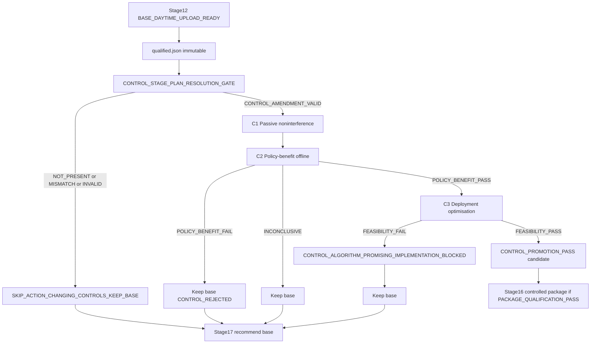

# V4.3 Control Two-Verdict Addendum (Stages 13–16 only)

## Authority

```text
Parent (frozen; do not edit):
  plans/v4_3_daytime_to_package_5333a24e.plan.md
  → governs Stages 0–12 and Stages 17–19

This addendum:
  plans/v4_3_control_two_verdict_c7e2f91a.plan.md
  → supersedes only Stages 13–16
```

Creating this file does **not** automatically alter a running agent executing the parent plan. Adoption requires `CONTROL_STAGE_PLAN_RESOLUTION_GATE` → `CONTROL_AMENDMENT_VALID`.

Manifest: `experiments/manifests/control_algorithm_vs_implementation_amendment.json`

Audit: `experiments/reports/control_algorithm_vs_implementation_audit.md`

---

## CONTROL_STAGE_PLAN_RESOLUTION_GATE (mandatory before Stage 13)

At end of Stage 12 (`BASE_DAYTIME_UPLOAD_READY` with immutable `qualified.json`), resolve:

```text
experiments/manifests/control_algorithm_vs_implementation_amendment.json
```

Verify:

- `parent_plan_sha256` equals the frozen parent plan SHA recorded in V4.3 programme state
- `amendment_plan_sha256` equals the SHA of this file (or the recorded amendment path)
- required fields present: `supersedes_stages`, `fallback_if_missing`, `required_before_control_execution`

| Outcome | Action |
|---|---|
| `CONTROL_AMENDMENT_VALID` | Execute Stages 13–16 as defined here (C1→C2→C3) |
| `CONTROL_AMENDMENT_NOT_PRESENT` | Skip action-changing controls; keep qualified base |
| `CONTROL_AMENDMENT_PARENT_MISMATCH` | Skip action-changing controls; keep qualified base |
| `CONTROL_AMENDMENT_INVALID` | Skip action-changing controls; keep qualified base |

**Mandatory fallback:**

```text
fallback_if_missing = SKIP_ACTION_CHANGING_CONTROLS_KEEP_BASE
```

Do **not** execute the parent plan’s thin Stages 13–16 controller logic when the amendment is absent or invalid. Continue to Stage 17 recommendation with the immutable base.

---

## Corrected control flow

```text
Base package
  → CONTROL_STAGE_PLAN_RESOLUTION_GATE
  → C1 passive noninterference
  → C2 policy-benefit test
  → C3 implementation-feasibility test
  → controlled package (only if both pass + package qual)
```

Not: `controller tried → passed or failed`.



---

## Locked statuses

```text
CONTROL_POLICY_BENEFIT_PASS
CONTROL_POLICY_BENEFIT_FAIL
CONTROL_POLICY_BENEFIT_INCONCLUSIVE

CONTROL_IMPLEMENTATION_FEASIBILITY_PASS
CONTROL_IMPLEMENTATION_FEASIBILITY_FAIL
CONTROL_IMPLEMENTATION_NOT_YET_OPTIMISED

CONTROL_PROMOTION_PASS
CONTROL_ALGORITHM_PROMISING_IMPLEMENTATION_BLOCKED
CONTROL_IMPLEMENTATION_FAST_BUT_NO_POLICY_BENEFIT
CONTROL_REJECTED
```

Final controlled promotion requires:

```text
CONTROL_POLICY_BENEFIT_PASS
∧ CONTROL_IMPLEMENTATION_FEASIBILITY_PASS
∧ PACKAGE_QUALIFICATION_PASS
```

---

## Decision matrix

| Policy benefit | Implementation | Result |
|---|---|---|
| Pass | Pass | Controlled package may enter confirmation |
| Pass | Fail | `CONTROL_ALGORITHM_PROMISING_IMPLEMENTATION_BLOCKED`; keep base |
| Pass | Not optimised | Optimise within frozen budget; keep base |
| Fail | Pass | `CONTROL_IMPLEMENTATION_FAST_BUT_NO_POLICY_BENEFIT`; reject controller |
| Fail | Fail | `CONTROL_REJECTED` |
| Inconclusive | Any | Do not promote; keep base |

Never describe `CONTROL_ALGORITHM_PROMISING_IMPLEMENTATION_BLOCKED` as “the controller is not useful.”

---

## Hard limits (unchanged from parent intent)

- ≤8 total variants across families
- ≤2 finalists
- Total control wall-clock budget frozen before Stage 13
- Families: OFF → STATIC_RISK → PI → BARRIER → BOUNDED_MPC → COMBINED (evidence-gated)
- Separate candidate/build path from the immutable base ZIP
- Control failure must leave `qualified.json` and base ZIP untouched

---

## Stage 13 / C1 — Passive noninterference

With telemetry off versus on, require identical:

- actions
- legal support
- recurrent state
- RNG state where relevant
- game outcomes
- protocol output

Record telemetry overhead separately. Telemetry must not change decisions.

Evidence pattern: extend `tests/competition_native_jax/test_telemetry_noninterference.py` and existing stubs in `src/generals_bot/controls/__init__.py`.

---

## Stage 14 / C2 — Controller algorithmic-benefit evaluation

**Question:** Does the controller select better actions than `CONTROL_OFF`?

Evaluate independently of avoidable prototype overhead.

Use the same frozen:

- base policy and model weights
- observations
- legal support
- recurrent input
- seeds, seat swaps, opponents
- controller parameters

Compare `CONTROL_OFF` versus `CONTROL_ON`. Record base action and controlled action for every intervention.

### Valid C2 implementations (choose one that does not contaminate strength with deadline faults)

1. Batched vectorised JAX controller for offline evaluation
2. Vectorised NumPy implementation
3. Precomputed controller-decision replay derived from frozen policy outputs
4. Another implementation that demonstrably reproduces the controller mathematics without deadline faults contaminating game strength

**Defaults:**

- STATIC_RISK / PI / barrier research: **vectorised NumPy**
- Bounded MPC research screening: batched JAX **or** vectorised NumPy
- Never use unoptimised package play as the first strategic verdict

Do not silently grant extra information or future state. Do not use privileged full-state fields the deployed package cannot observe.

### Metrics

Strategic effects including: paired score difference; targeted failure-rate difference; intervention count; intervention precision; false-positive interventions; general survival; castle survival; reserve preservation; Deathtouch outcomes; draw rate; opponent-specific effects; seat-specific effects.

For paired seed \(i\):

\[
d_i = S_i^{\mathrm{CONTROL\_ON}} - S_i^{\mathrm{CONTROL\_OFF}}
\]

\[
\bar d = \frac{1}{n}\sum_{i=1}^{n} d_i
\]

Use the frozen paired confidence procedure from the daytime evaluation protocol lineage.

For targeted failure metric \(F\):

\[
\Delta F = F_{\mathrm{CONTROL\_ON}} - F_{\mathrm{CONTROL\_OFF}}
\]

Policy benefit PASS only when the preregistered target improves and the frozen broader suite does not materially regress.

**Deadline faults caused only by an unoptimised prototype must not be used as evidence that the controller’s decision rule is strategically bad.** Report them separately as implementation failures.

---

## Stage 15 / C3 — Controller implementation optimisation

Run only for variants that PASS or remain credible under C2.

Produce where useful:

```text
research_controller
deployment_controller
```

- Research may use JAX for batched GPU evaluation.
- Deployment must use the fastest **package-compatible** method justified by measurement, typically: vectorised NumPy; bounded scalar Python with preallocated data; lookup tables; precomputed geometry; compact top-K; or an already permitted lightweight runtime.

**Do not assume JAX is faster for single-turn CPU inference.**

**Do not vendor JAX or jaxlib into the ZIP** unless competition package rules and measured constraints explicitly permit it and it materially wins. Default: **no JAX in the package**.

Avoid Python loops across the complete 3,970-action space when the same calculation can be vectorised, restricted to legal actions, restricted to top-K, based on precomputed geometry, calculated incrementally, or expressed through fixed-size arrays.

### Latency decomposition (mandatory)

Do not benchmark only total package latency.

\[
L_{\mathrm{total}} = L_{\mathrm{parse}} + L_{\mathrm{observation}} + L_{\mathrm{model}} + L_{\mathrm{controller\_features}} + L_{\mathrm{controller\_decision}} + L_{\mathrm{encoding}} + L_{\mathrm{output}}
\]

For `CONTROL_OFF` and `CONTROL_ON` record: p50, p95, p99, maximum; warm and first-turn; each supported board size; castle path; Deathtouch path; high-legal-action-count states; maximum-controller-intervention states.

\[
\Delta L_{\mathrm{controller},p99} = L_{\mathrm{CONTROL\_ON},p99} - L_{\mathrm{CONTROL\_OFF},p99}
\]

Derive controller headroom from the frozen internal deployment budget (`experiments/manifests/competition_native_jax_deployment_limits.json`):

\[
L_{\mathrm{controller,max}} = L_{\mathrm{total,budget}} - L_{\mathrm{base},p99} - L_{\mathrm{protocol},p99} - M_{\mathrm{safety}}
\]

Freeze \(M_{\mathrm{safety}}\) **before** seeing results. Do not invent a favourable safety reserve after seeing results.

Final controlled package must still satisfy:

\[
L_{\mathrm{total},p99} \le 100\,\mathrm{ms}
\]

plus memory, size, and cold-start limits.

Positive strategic benefit with \(L_{\mathrm{total},p99} > 100\,\mathrm{ms}\) → `CONTROL_ALGORITHM_PROMISING_IMPLEMENTATION_BLOCKED` until an optimised implementation passes. Must not replace the qualified uncontrolled base.

### Research ↔ deployment parity

For every frozen fixture, compare: controller feature values; risk score; opportunity score; PI state; barrier value; MPC candidate scores; intervention decision; final action; fallback action.

Require:

\[
a^{\mathrm{research}}_{\mathrm{controlled}} = a^{\mathrm{deployment}}_{\mathrm{controlled}}
\]

for all deterministic parity fixtures. Define floating-point tolerances **before** final confirmation.

Include fixtures: rectangular boards; castles; general threats; Deathtouch; turn cap; no-intervention; high-risk; top-K ties; latency fallback; controller-state reset between games.

---

## Stage 16 — Controlled package qualification

Only after `CONTROL_POLICY_BENEFIT_PASS` and `CONTROL_IMPLEMENTATION_FEASIBILITY_PASS`.

Build on a **separate** candidate path. Source-versus-package parity, Linux/package gates, and deployment limits apply as for the base. No overwrite of Stage 12 ZIP/SHA/`qualified.json`.

If qualification fails → keep base; classify implementation/package failure honestly.

---

## Controller-family rules

### Static risk

\[
q_c(a\mid x) = q(a\mid x) - \lambda_r R(a,x) + \lambda_o O(a,x)
\]

Benchmark feature extraction and rescoring separately. Prefer vectorised rescoring over legal actions or frozen top-K base-policy actions — not full 3,970 scans when unnecessary.

### PI controller

\[
e_t = r_t^{\mathrm{observed}} - r^{\mathrm{target}},\quad
I_t = \mathrm{clip}(I_{t-1}+e_t, I_{\min}, I_{\max}),\quad
u_t = K_p e_t + K_i I_t
\]

Require: fixed-size state; O(1) update; reset between games; research/deployment parity; no per-turn history scanning.

### Barrier filter

For safety measure \(h(x)\ge 0\) and candidate successor test \(h(x_{t+1})\ge (1-\alpha)h(x_t)\): restrict to a bounded candidate set; precompute static geometry where possible. Do not claim formal safety when the successor approximation is not exact.

### Bounded MPC

\[
J = \sum_{k=0}^{H-1}\big[w_p P(x_k) - w_r R(x_k) - w_u C(u_k)\big] + w_T V(x_H)
\]

Freeze: \(K\), \(H\), feature set, dynamics approximation, weights, deadline, fallback. Fixed top-K; preallocated buffers; no dynamic graph construction; no unbounded search; hard deadline; deterministic fallback to best already-scored base-policy action.

Report separately:

```text
MPC_POLICY_BENEFIT
MPC_IMPLEMENTATION_COST
```

Do not reject MPC as strategically ineffective solely because a nested Python-loop prototype is slow. Do not promote solely because a JAX batched evaluator is fast on GPU — the CPU package must pass C3 separately.

---

## Base-package protection

Stage 12 must already have frozen:

```text
BASE_DAYTIME_UPLOAD_READY
```

with immutable ZIP, SHA-256, package report, qualification report, and competitive evidence in `submission/roles/qualified.json`.

Controller work occurs only on a separate candidate/build path. A controller failure, timeout, or implementation problem leaves the base package untouched and still eligible for final recommendation (Stages 17+ under the parent plan).

---

## Recommended backends (locked defaults)

| Role | Backend |
|---|---|
| C2 research (STATIC_RISK / PI / barrier) | Vectorised NumPy |
| C2 research (MPC screening) | Batched JAX or vectorised NumPy (offline) |
| C2 alternative | Precomputed controller-decision replay |
| C3 deployment | Vectorised NumPy / bounded Python / LUT / top-K |
| Package ZIP | **No jax/jaxlib** by default |

---

## Tests required before promoting a controlled package

Record now; implement when Stages 13–16 execute (not part of the audit-only artefact task):

1. C1 exact noninterference (actions, support, recurrent, RNG, protocol)
2. C2 paired policy-benefit fixtures; prototype deadline faults classified as implementation, not benefit FAIL
3. Research↔deployment parity on frozen fixtures
4. Latency decomposition unit + package gate for CONTROL_OFF vs ON
5. Promotion matrix classification for all six decision-matrix rows
6. No-JAX-in-ZIP assertion for controlled package
7. Handoff gate classification: VALID / NOT_PRESENT / PARENT_MISMATCH / INVALID

---

## Explicit non-goals of this plan document alone

This addendum does not authorise training, overnight, upload, Phase 10, or controller implementation until:

```text
BASE_DAYTIME_UPLOAD_READY
∧ CONTROL_AMENDMENT_VALID
```

and the operator proceeds into Stages 13–16 under programme authorisation.
