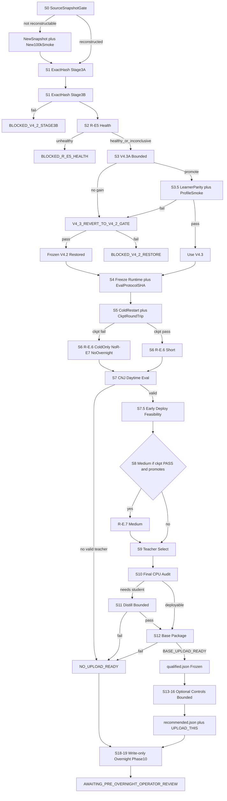

# V4.2 Closure → Daytime Training → Package → Pre-Overnight Readiness (Amended)

## Verified starting facts (re-resolve on execute)

- Systems gate READY: **189.71 TPS** @ `32×32×4096`
- R-E.5 smoke: 100352 transitions, 98 updates, ~136 TPS — **params/EMA only; no optimiser state**
- Stage 3A passed historically; **full Stage 3B for V4.2 env hash missing**
- Hash drift: ladder `2385672e…` vs smoke `4d8660fd…` vs worktree (re-resolve)
- Owned processes empty; submission still `NO_CANDIDATE_CURRENTLY_RECOMMENDED`
- Auth: require exact block below; overnight/upload/portal/Phase10-exec/rental/main-merge/auto-push false

## Exact authorisation (required to start)

Execution begins only when the operator message includes this block (or an unambiguous equivalent with every flag named):

```text
AUTHORIZE_V4_3_DAYTIME_TO_PACKAGE=true

Execute plans/v4_3_daytime_to_package_5333a24e.plan.md through its daytime,
evaluation, deployment, packaging and write-only readiness stages.

overnight_execution_authorized=false
portal_upload_authorized=false
portal_mutation_authorized=false
phase10_execution_authorized=false
rental_compute_authorized=false
main_merge_authorized=false
auto_push_authorized=false
```

General “execute the plan” without these flags is insufficient for any prohibited terminal stage. Daytime-to-package stages alone proceed under `AUTHORIZE_V4_3_DAYTIME_TO_PACKAGE=true` with all seven false flags recorded in programme state.

## Locked defaults

- **Parent:** `R_E6_PARENT_COMPATIBLE_COLD_RESTART` using the same initialisation R-E.5 used. Parameter warm-start is **not** the default and must be frozen before R-E.6 if ever used (with step-zero policy reproduction). Never claim exact resume without opt_state.
- **V4.3A only before package** (see Stage 3). V4.3B deferred until after a daytime package exists unless V4.3A exposes a specific blocker.
- **Budget TPS / rollback TPS:** sustained **operational** TPS from the frozen smoke (or new-smoke) manifest — **not** clean microbenchmark TPS (~189.71). Resolve the exact non-rounded operational value at Stage 0.
- **Eval:** new `scripts/run_competition_native_jax_daytime_eval.py` — reuse paired-seed/resume/heartbeat patterns from phase9fu; **do not** inherit Tactical/Hybrid/V002 semantics.
- Failed control / failed V4.3 / failed medium does not erase a valid earlier base or R-E.6 teacher when frozen gates allow.
- **No further conceptual architecture revision** after execution starts; amendments need a new plan ID + hash.



---

## Stage 0 — Plan archive + source snapshot + V4.2 freeze

### Plan archive (first action)

Copy the Cursor plan **unchanged** into the repository:

```text
plans/v4_3_daytime_to_package_5333a24e.plan.md
```

Source: `C:\Users\pries\.cursor\plans\v4.3_daytime_to_package_5333a24e.plan.md`

Record in the V4.3 programme-state manifest:

- `plan_path`
- `plan_sha256`
- `plan_source_path`
- `authorisation_timestamp`
- all seven authorisation flags from the exact auth block

Do **not** edit that copied plan after execution starts. Amendments require a new plan ID and hash.

### Source snapshot

Record separately:

- `ladder_env_implementation_hash`
- `smoke_env_implementation_hash`
- `current_worktree_env_implementation_hash`

Reconstruct R-E.5 implementation vs worktree.

**If reconstructable (`R_E5_SOURCE_RECONSTRUCTED`):** Stage 3A/3B and health audit may apply to that smoke lineage.

**If not reconstructable (`R_E5_SOURCE_NOT_RECONSTRUCTABLE`):** preserve R-E.5 as historical smoke evidence only; choose a clean current source snapshot (feature-branch commit preferred, or content-addressed manifest); run exact-hash 3A+3B; run a **new** bounded 100k smoke on that snapshot as the health baseline. Do **not** claim the old ~136 TPS or smoke health for the new snapshot until remeasured. Do not block the whole programme merely because a dirty old worktree cannot be reproduced.

Selected runtime identity: `git_commit`, `source_manifest_sha`, `env_semantics_hash`, `env_implementation_hash`, `learner_implementation_hash`, `training_config_sha`.

### V4.2 frozen TPS baseline (explicit separation)

In `competition_native_jax_v4_2_frozen_baseline.json` (and programme state), record separately from the smoke/ladder manifests (exact non-rounded values at Stage 0 — do not hard-code `136`):

```text
clean_benchmark_tps     ← systems / clean valid-learning ladder (~189.71)
operational_smoke_tps   ← R-E.5 smoke (or new-smoke) operational TPS
restore_threshold_tps   ← 0.90 × operational_smoke_tps
```

`V4_3_REVERT_TO_V4_2_GATE` and daytime budget planning use **operational** TPS and `restore_threshold_tps`, never 90% of clean microbenchmark.

Create V4.3 programme state + V4.2 frozen baseline (`PROVISIONAL_…_PENDING_V4_2_STAGE_3B`). Never overwrite frozen V4 / V4.1 / `v4_2_*`.

Only hard-stop `BLOCKED_SOURCE_LINEAGE` when no usable current snapshot can be formed.

---

## Stage 1 — Exact-hash Stage 3A then Stage 3B

```text
DAYTIME_SOURCE_SNAPSHOT_GATE
→ if Stage 3A artefact hash == selected hash: preserve PASS
→ else: rerun Stage 3A on selected hash
→ STAGE_3A_EXACT_HASH_PASS
→ full Stage 3B on same hash
→ STAGE_3B_EXACT_HASH_PASS
```

3B minima: ≥1000 games, ≥100k transitions, 0 required mismatches; seats; boards 18–21 rectangular; castles; Deathtouch; turn-cap; reset-pool distribution vs canonical `reset_one_jax`; legal support; tracer-leak multi-shape with `JAX_CHECK_TRACER_LEAKS`.

Outputs: `competition_native_jax_v4_2_stage3b_final.{json,md}`. Fail → `BLOCKED_V4_2_STAGE3B` (no train/package).

---

## Stage 2 — R-E.5 health audit

Audit applicable smoke (reconstructed R-E.5 or new snapshot smoke) → `competition_native_jax_v4_2_r_e5_health_gate.json`.

```text
healthy or system-healthy/inconclusive → Stage 3
unhealthy → BLOCKED_R_E5_HEALTH (hard stop)
```

Proceed only on `R_E5_HEALTHY` or `R_E5_LEARNING_SIGNAL_INCONCLUSIVE_BUT_SYSTEM_HEALTHY`.

---

## Stage 3 — Bounded V4.3A (pre-package only)

**Authorised before daytime training:** tracer-safe isolated subprocesses; shape search (envs/rollout/pool/unroll); safe BF16 bake-off; safe donation + obvious buffer lifetime; telemetry/checkpoint frequency; Linux-native runtime storage. Always include control `32×32×4096`.

**Hard limits:** ≤16 completed candidates; ≤4 finalists; ≤3 accepted implementation change classes.

**Promote only if** sustained operational valid-learning TPS ≥ **15%** above frozen V4.2 operational baseline, **or** equal TPS with materially better thermal/VRAM/reliability — and all correctness/budget gates hold.

**V4.3B deferred** until after a daytime package (unless V4.3A exposes a blocker): legal-support redesign, structural seat dedup, custom masked categorical, RNG kernel restructure, pool double-buffer, broad traj schema redesign.

Outcome: `V4_3_PROMOTED` or `V4_3_NO_MATERIAL_GAIN_USE_V4_2`.

### Stage 3.5 — Promoted V4.3 selected-profile gate (mandatory if promoted)

1. **Learner parity:** full-batch loss/grad parity; one logical Optax update; param-update parity; zero-update ratio ~1; checkpoint compatibility; support mismatch 0. If accumulation enabled: `g_acc ≈ g_full` and exactly one optimiser step.
2. **Selected-profile smoke:** ≥100k transitions **or** 30 minutes (first limit wins) → `V4_3_SELECTED_PROFILE_HEALTHY`.

On fail: run **`V4_3_REVERT_TO_V4_2_GATE`** — restore the **entire** frozen V4.2 source snapshot (commit/manifest, env+learner impl, dtype, legal-support, checkpoint schema, static profile, build config, selected runtime manifest). Require before R-E.6:

- operational TPS ≥ `restore_threshold_tps` (= `0.90 × frozen operational_smoke_tps`, not clean ~189.71)
- legal rate = 1; support mismatches = 0
- lineage hashes = frozen V4.2 hashes

If revert check fails: `BLOCKED_V4_2_RESTORE`. Never leave a rejected V4.3 patch partially active while claiming “using V4.2.”

If V4.3 changes env/legal/obs/reset/action mapping: update hashes and re-run 3A+3B before training.

---

## Stages 4–5 — Freeze runtime + parent + checkpoint round-trip + eval protocol

Freeze `daytime_runtime_selected.json` (V4.3 if Stage 3.5 passed else V4.2).

**Before launching R-E.6 (mandatory):**

1. Validate `competition_native_jax_daytime_evaluation_protocol_v1.json`
2. If incomplete/stale: create **v2** now
3. Freeze protocol SHA-256
4. Record `evaluation_protocol_id` + `evaluation_protocol_sha256` in the R-E.6 launch manifest
5. Never edit that version after the R-E.6 process begins

Every training checkpoint must carry `evaluation_protocol_id` and `evaluation_protocol_sha256`.

**Parent classifications (exclusive):**

| Class | Meaning |
|---|---|
| `R_E6_PARENT_COMPATIBLE_COLD_RESTART` | **Default.** Same original init as R-E.5 (or new-smoke init); new opt/RNG/lineage |
| `R_E6_PARENT_PARAMETER_WARM_START_OPTIMIZER_RESET` | Only if frozen pre-R-E.6; load smoke raw; reset Optax; step-zero policy match |
| `R_E6_PARENT_EXACT_RESUME` | Full training state present (not available from current smoke) |

**Checkpoint schema** (required for R-E.7 / overnight): raw, EMA, Optax, update#, transitions, LR schedule, model/env RNG, reset-pool seed+cursor, curriculum, config/source hashes, dtype/static profile, eval protocol id+sha.

**Round-trip test:** uninterrupted updates 1–2 vs save after 1 → new process → load → update 2.

```text
CHECKPOINT_EXACT_CONTINUATION_PASS
→ R-E.6, R-E.7, overnight parent eligible

CHECKPOINT_TRAINING_STATE_ROUNDTRIP_FAIL
→ fix within Stage 5 and retest if in scope
→ else R-E.6 cold restart may still run
→ R-E.7 exact resume DISABLED
→ overnight-parent selection DISABLED
→ no resumability claims
```

Budgets in **complete updates**:

```text
samples_per_update = measured transitions per completed logical PPO update
max_complete_updates = floor((0.85 × operational_tps × permitted_seconds) / samples_per_update)
transition_budget = max_complete_updates × samples_per_update
```

Milestones 0/25/50/75/100% on valid update boundaries.

---

## Stages 6–7 — R-E.6 short + CNJ daytime eval

New owned WSL job (not blind `run_quantsilico_resume_r_e.sh`). Max 90 minutes; first limit wins. Launch manifest includes frozen eval protocol SHA. Checkpoints embed protocol id+sha.

**Evaluator:** create [`scripts/run_competition_native_jax_daytime_eval.py`](scripts/run_competition_native_jax_daytime_eval.py). Reuse paired seeds, resumability, heartbeat, per-pair progress, SIGINT persistence, timeouts. Do **not** reuse Tactical/Hybrid/V002/phase9fu role assumptions.

### Independently valid trained checkpoint gate

```text
INDEPENDENTLY_VALID_TRAINED_CHECKPOINT_GATE
→ VALID_DAYTIME_TEACHER | RESEARCH_ONLY_CHECKPOINT | NO_VALID_TRAINED_CHECKPOINT
```

Only `VALID_DAYTIME_TEACHER` may enter CPU audit / distill / package / controls.

Examples: `R_E6_PROMOTES_TO_MEDIUM` → medium (only if ckpt round-trip PASS); `R_E6_VALID_BUT_MEDIUM_NOT_REQUIRED` → select R-E.6 teacher; `STABLE_BUT_NO_STRENGTH_GAIN` / `REGRESSED` / `INCONCLUSIVE` → research only → no package.

---

## Stage 7.5 — Early deployment feasibility (before R-E.7)

Between short eval and medium:

```text
EARLY_DEPLOYMENT_FEASIBILITY_GATE
→ DEPLOYMENT_ARCHITECTURE_FEASIBLE
| REQUIRES_DISTILLATION_TEACHER_TRAINING_ALLOWED
| REQUIRES_QUANTISATION
| DEPLOYMENT_RUNTIME_BLOCKED
```

Check teacher export, JAX↔export logits/action match, student obs/action contract, NumPy path, memory export, legal support recreate, no forbidden deps. Medium of an undeployable architecture is allowed only when explicitly flagged as **teacher training**.

---

## Stages 8–9 — Conditional R-E.7 + teacher

R-E.7 (≤4h) only when short promotes **and** `CHECKPOINT_EXACT_CONTINUATION_PASS`. Resume from selected raw + matching opt_state. Then freeze daytime teacher (raw/EMA by frozen eval).

---

## Stages 10–12 — Final CPU → distill → immutable base

Final CPU audit vs [`competition_native_jax_deployment_limits.json`](experiments/manifests/competition_native_jax_deployment_limits.json).

### Distillation contract (when required)

**Hard limits:** ≤2 student architectures; ≤6 hyperparameter configs; ≤3 full training runs; ≤3 checkpoints into confirmation; ≤1 dataset regeneration. Default `student_emb96_d2_h4`; second architecture only when first fails a clear deploy/capacity gate.

- **Visible-only fields:** obs, legal support, recurrent input, teacher legal logits/logp, selected action, value, seat, dims, turn, episode ID, terminal, teacher checkpoint hash. No privileged full state.
- **Sources (proportions frozen before train):** teacher self-play; vs V001; vs Hunter; vs Expander; castle/Deathtouch fixtures; frozen-eval failure cases.
- **Partitions:** train / validation / final holdout — no episode/seed overlap.
- **Loss:** frozen `λ_π L_policy-KL + λ_a L_selected + λ_v L_value + λ_m L_memory` before holdout.
- Random-weight latency is **not** strength evidence.

### Base daytime release checkpoint (qualified ≠ recommended)

```text
BASE_DAYTIME_RELEASE_CHECKPOINT
→ BASE_DAYTIME_UPLOAD_READY | RESEARCH_ONLY | BLOCKED_PACKAGE | REJECTED_COMPETITIVE
```

When base passes **immediately**:

1. Freeze ZIP + SHA-256 + qualification report (never overwrite)
2. Write [`submission/roles/qualified.json`](submission/roles/qualified.json) with the uncontrolled base (`BASE_DAYTIME_UPLOAD_READY`)
3. Terminal note: upload-ready base exists and remains valid if control lane fails; **no upload has occurred**
4. Do **not** wait for controls to preserve the base

Package via extend [`builder.py`](src/generals_bot/submission/builder.py) + `scripts/package_competition_native_jax_qs_p9g.py`; no JAX in ZIP. IDs: `QS-P9G-COMPETITION-POLICY-DAY-V1` or `…-STUDENT-DAY-V1`.

Honest non-package outcomes remain valid and mean the plan worked: no learning → no teacher → no package; student strength collapse → no deployable learned package; competitive threshold miss → research-only; V4.3A no gain → restore V4.2; base qualifies while controls fail → recommend base; technically valid ZIP below threshold → research-only. Never manufacture `BASE_DAYTIME_UPLOAD_READY` merely because Stage 12 was reached.

---

## Stages 13–17 — Controls + one recommendation

Once `BASE_DAYTIME_UPLOAD_READY` passes, the **package objective is achieved**. Controls are an optional bounded improvement lane and must never delay or overwrite preservation of the base.

**Control hard limits:** ≤8 total variants across families; ≤2 finalists; total control wall-clock budget frozen before Stage 13.

Passive noninterference first. Action-changing only if evidence gate PASS. If evidence absent or control fails: keep qualified base.

**Registries:**

| File | When | Content |
|---|---|---|
| `submission/roles/qualified.json` | Stage 12 | Immutable uncontrolled base |
| `submission/roles/recommended.json` | Final | Controlled if better+valid, else the base |
| `submission/UPLOAD_THIS.md` | Final recommendation only | Matches recommended.json |

At most one recommendation; keep UPLOAD_THIS and recommended.json consistent.

---

## Stages 18–19 + hard stop

Write-only overnight parent + Phase 10 readiness (`DO NOT EXECUTE`). Overnight parent requires Stage 3B pass, frozen runtime, useful learning, resumable opt_state, `CHECKPOINT_EXACT_CONTINUATION_PASS`.

Stop all owned jobs; prove empty list; terminal artefacts with `UPLOAD_READY_DAYTIME_CANDIDATE_EXISTS` or `NO_UPLOAD_READY_DAYTIME_CANDIDATE` and `AWAITING_PRE_OVERNIGHT_OPERATOR_REVIEW`.

---

## Code to add/reuse

| Need | Action |
|---|---|
| Source snapshot gate | Manifest of runtime files + hashes; optional local feature commit |
| Exact-hash 3A/3B | Adapt `_run_e2e_3b_5_6.sh` → `_run_v4_2_stage3b.sh`; rerun 3A if hash mismatch |
| V4.3A ladder | Isolated subprocesses; hard candidate caps; Stage 3.5 smoke |
| Full checkpoint | `save_tree`/`load_tree` + opt/RNG/pool/curriculum; round-trip test |
| R-E.6/7 | `_run_v4_3_r_e6.sh` / `_run_v4_3_r_e7.sh` with complete-update budgets |
| Daytime eval | **New** `run_competition_native_jax_daytime_eval.py` (pattern reuse only) |
| Distill + package | Frozen dataset/loss; NumPy student; extend `builder.py`; Linux parity |
| Early deploy gate | After short eval, before medium |
